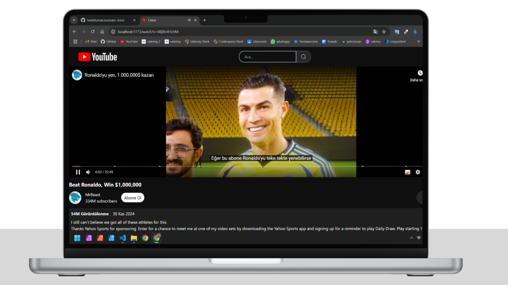

# YOUTUBE CLONE

 

  

  

Bu proje, **YouTube API** kullanılarak oluşturulmuş bir YouTube klonudur. React ile geliştirdiğim bu projede kullanıcılar farklı kategorilerde videolar seçebilir, videoları izleyebilir, kanalların açıklamalarını ve video yorumlarını görüntüleyebilir.

  

  

  

  

  

## Özellikler

- **Kategori Seçimi**: Kullanıcılar, aşağıdaki kategoriler arasından seçim yaparak videoları filtreleyebilir:
  - Anasayfa
  - Trendler
  - Müzik
  - Filmler
  - Canlı
  - Oyun
  - Haberler
  - Spor
  - Eğitici
  - Güzellik & Kozmetik
- **Video Ön İzleme**: Videoların ön izlemeleri liste şeklinde görüntülenebilir.
- **Video İzleme**: Seçilen videolar tam ekran izlenebilir.
- **Kanal Açıklamaları**: Videonun yüklendiği kanal hakkında bilgi alınabilir.
- **Yorumlar**: Videoların yorumlarını görüntüleme imkanı.

  
    
  

  

  
    
  

  

  
    
  

## Kullanılan Teknolojiler

- **React**: Arayüz bileşenleri oluşturmak için.
- **Tailwind CSS**: Tasarım ve düzenlemeler için.
- **React Icons**: İkonlar için.
- **React Player**: Video oynatma bileşenleri için.
- **React Router Dom**: Sayfa geçişleri sağlamak için.
- **Axios**: API çağrıları için.
- **Millify**: Büyük sayıları insan tarafından okunabilir hale getirmek için.

  

  

 

  <a href="/" style="font-size: 20px; color: #FF0000;">Web sitesine şu an erişilemiyor.</a>

 
 

## Renk Paleti

  

  

  

